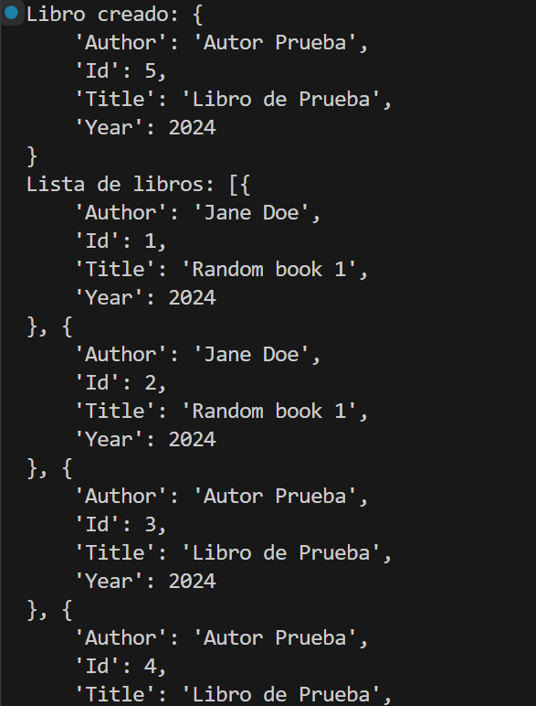
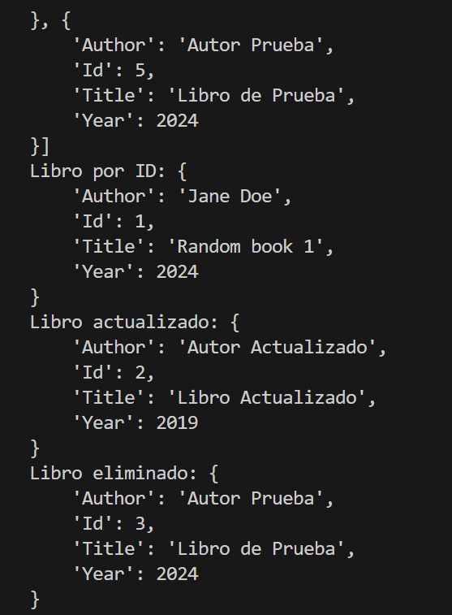
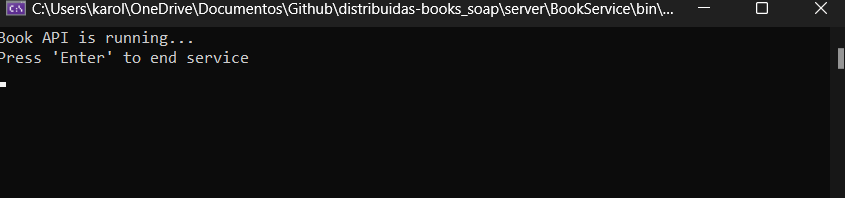
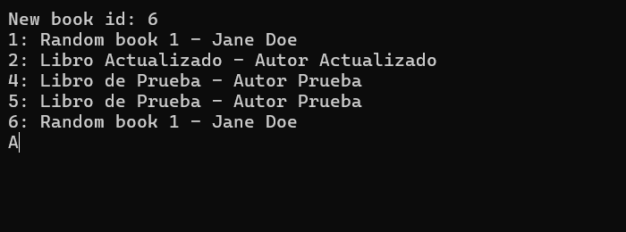

# CRUD SOAP

<aside>
📖 Universidad de las Fuerzas Armadas - ESPE
Realizado por:
✅ Cristian Tello
✅ Karol Macas
✅ Mateo Barriga
24 de noviembre de 2024 
🖥️ Aplicaciones Distribuidas - NRC: 2546
🖥️ Proyecto: [https://github.com/karol-macas/distribuidas-CRUD_SOAP](https://github.com/karol-macas/distribuidas-CRUD_SOAP)

</aside>

# **Introducción**

Este proyecto es un cliente SOAP diseñado para interactuar con el servicio `BookService`, que permite gestionar libros (crear, actualizar, eliminar y consultar). El cliente está implementado utilizando Python y la biblioteca zeep.

# Cliente SOAP

### 1. Instalar la biblioteca **Zeep**

Primero, asegúrate de tener instalada la biblioteca **Zeep**. Puedes hacerlo mediante **pip**:

pip install zeep

### 2. Código para consumir el servicio `BookService` en Python

Creamos un cliente en Python que consuma el servicio `BookService`.

```python
from zeep import Client

url = "http://localhost:2317/BookSoap?wsdl"
client = Client(url)

# Crear un libro
new_book = {"Title": "Libro de Prueba", "Author": "Autor Prueba", "Year": 2024}
response = client.service.CreateBook(newBook=new_book)
print("Libro creado:", response)

# Obtener todos los libros
books = client.service.GetBooks()
print("Lista de libros:", books)

# Obtener un libro por ID
book = client.service.GetBook(1)
print("Libro por ID:", book)

# Actualizar un libro
update_book = {"Id": 2, "Title": "Libro Actualizado", "Author": "Autor Actualizado", "Year": 2019}
response = client.service.UpdateBook(updateBook=update_book)
print("Libro actualizado:", response)

# Eliminar un libro
response = client.service.DeleteBook(3)
print("Libro eliminado:", response)

```

### Ejecutar Cliente

> python  Client.py
> 





# Servidor

Dentro de nuestro servidor tendremos dos carpetas en donde iremos explicando que es lo que contiene cada una de ellas y que función tiene. 


Dentro de nuestra carpeta de BookService tenemos lo que es el el archivo para a configuración de un servicio de WFC en .NET. Esto esta hecho en XML y se encuentra el archivo de configuracion como web.config o app.config. 

Los puntos destacar son:

- Se desarrolla en la direccion http://localhost:2317/BookSoap
- Contiene un endpoint princiál para comunicarse usando el metod de basicHttpBinding
- Expone metadatos para descubir a traves de un endpotin de metatada exhange
- tiene configuraciones para depurar y publicar metadatos


Tambien  contiene un documento general llamado [Program.c](http://Program.cd)s en donde este contiene el servico de BookSoap en donde esta alojado usando el ServiceHost. Este servicio eschuca las olicitudes de los clientes. Ademas la consola muestra un mensaje si el servicio esta activo. 




Dentro de nuestra otra carpeta BookSoap tenemos: 


BOOK:

Este código define una clase llamada `Book` que está diseñada para ser utilizada en un servicio WCF, La clase está marcada con atributos específicos para permitir que sus datos se serialicen y transmitan entre el cliente y el servicio.


BookDTO:
El código define una clase llamada `BookDTO`, que actúa como un **Data Transfer Object (DTO)** para transferir datos relacionados con libros en un sistema, especialmente en un servicio WCF 

BookSoap: 

El código implementa un servicio SOAP llamado `BookSoap`, que gestiona una colección de libros. La clase utiliza una lista estática en memoria (`_books`) para almacenar y manipular los datos de los libros.

Flujo de codigo: 

- **Crear**: Usa `CreateBook` para agregar libros a `_books`, asignando automáticamente un `Id`.
- **Leer**: Usa `GetBook` para obtener un libro por su `Id` o `GetBooks` para obtener toda la lista.
- **Actualizar**: Usa `UpdateBook` para modificar las propiedades de un libro existente.
- **Eliminar**: Usa `DeleteBook` para eliminar un libro por su `Id`.

[http://localhost:2317/BookSoap](http://localhost:2317/BookSoap)


WSLD


### El cliente para interactuar con el servicio SOAP

- **Crear un libro:**
    - Se crea un `newBook` de tipo `BookDTO` con los detalles del libro y se llama al método `CreateBookAsync` para crear un nuevo libro.
- **Obtener todos los libros:**
    - Llamas al método `GetBooksAsync` para obtener una lista de todos los libros.
- **Obtener un libro por ID:**
    - Llamas al método `GetBookAsync` con el ID del libro que deseas obtener. Si el libro existe, se imprime su información.
- **Actualizar un libro:**
    - Se crea un objeto `updateBook` con el `Id` del libro que deseas actualizar y luego llamas al método `UpdateBookAsync` para actualizar ese libro.
- **Eliminar un libro:**
    - Llamas a `DeleteBookAsync` con el ID del libro que deseas eliminar.

